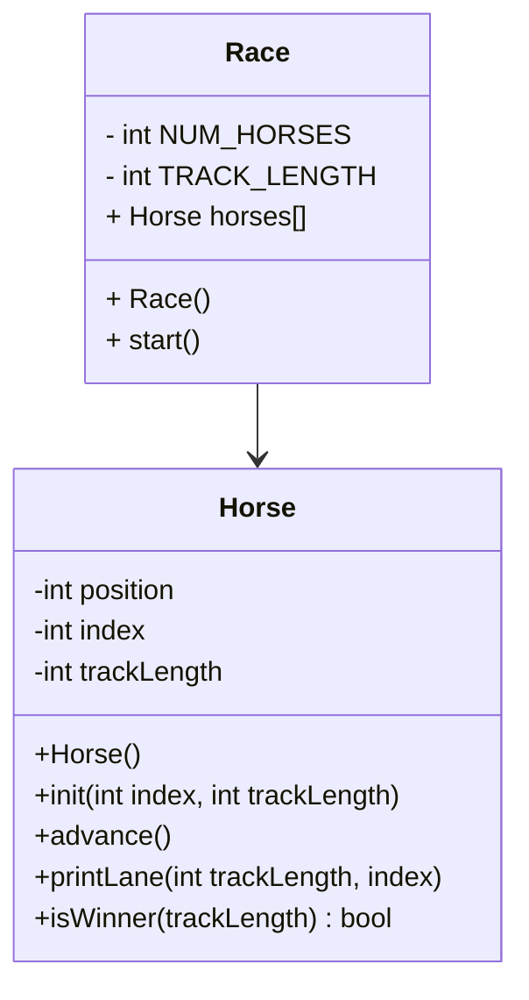

# horseRacer-OOP

## UML



## Race::Race()
```
const int TRACK_LENGTH
const int NUM_HORSES

Create an array of horses length NUM_HORSES
Initialize all the horses
for each horse
    initialize that horse with its index and the track length
```
### Race::start()
```
seed random
bool keepGoing
while keepGoing
    go through each horse:
        advance that horse
        print that horses lane
        if that horse won:
            set keepGoing to false
```

## Horse::Horse()
```
position = 0
index = 0
trackLength = 15
```

## void Horse::init(int index. int trackLength)
```
Horse::index = index
Horse::trackLength = trackLength
Horse::position = 0
```

## void Horse::advance()
```
roll a random 0-1 int, put in coin
add coin to position -> position
```

## void Horse::printLane()
```
for pos = 0 to trackLength:
    if Horse::positon == pos:
        print Horse::index
    else
        print .
```


## bool Horse::isWinner()
```
bool winning = false
if Horse::position == trackLength:
    winning = true
return winning
